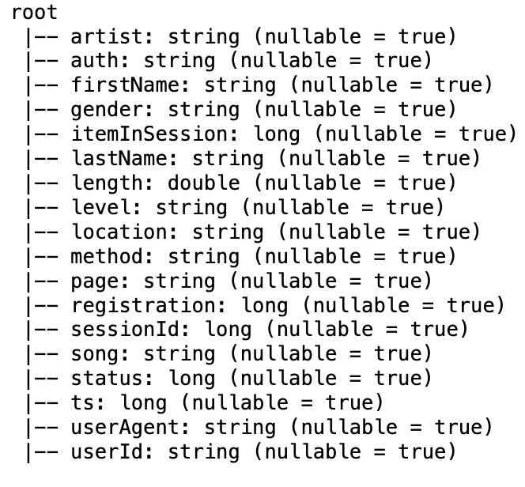
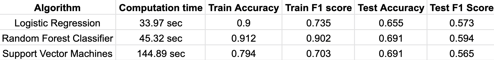

# Capstone Project

# Spark Project

## Churn prediction using PySpark

###  Overview:

Churn is the activity that represents an event where a user leaves a particular service. Analyzing the churning events is important for any business, since it directly affects the revenue.

Sparkify(fictional) is a leading music streaming service. Sparkify has two sections of users- free and paid users. Paid users enjoy the services without advertisements while the free users get advertisements while streaming. Both section of users can cancel the service anytime. The paid users can also downgrade to free version of the service and the free users can upgrade to the paid version.

Our aim is to build an ML model in a spark environment to predict the churning of an user given his events data. 

Whenever a user interacts with the service, the data gets recorded. Using these events data, we can deploy Machine learning algorithms to predict the churning of the users.

###  ETL overview:
The data is provided Udacity. The data is provided in the form of json file, which we have loaded as a spark data frame.

The schema is as shown in the image below.

The column page has a particular value called ‘Cancellation Confirmation’. This particular condition can be used to define churning.

The following features were selected.

**Categorical Features**
* Gender
* User level
* Browser
* OS
* Hour in which the user has spent the maximum time
* Day of the week in which the user has spent the maximum time
* Day of the month in which the user has spent the maximum time

**Numerical Features**
* Mean, Standard Deviation, Minimum and Maximum of the length
* Total Number of interactions for the following pages- ‘NextSong’, ’Thumbs Up’, ‘Thumbs Down’, ‘Add to Playlist’, ‘Add Friend’, ‘Roll Advert’
* Total number of songs streamed
* Number of unique songs streamed
* Number of unique artists streamed

For categorical features, we map the string column of labels to a column of label indices using [StringIndexer](https://spark.apache.org/docs/latest/api/python/reference/api/pyspark.ml.feature.StringIndexer.html) and encode the labels as one hot vectors using [OneHotEncoderEstimator](https://spark.apache.org/docs/2.3.0/api/java/org/apache/spark/ml/feature/OneHotEncoderEstimator.html).

For numerical features, we standardize the features by removing the mean component and scaling with the variance using. This is done using [StandardScaler](https://spark.apache.org/docs/latest/api/python/reference/api/pyspark.ml.feature.StandardScaler.html).

Once the features are processed, we combine them together using [VectorAssembler](https://spark.apache.org/docs/3.1.1/api/python/reference/api/pyspark.ml.feature.VectorAssembler.html).

###  Model building and results-

The following algorithms were deployed.
* Logistic Regression
* Random Forest Classifier
* Support Vector Machines

Their performances were recorded by measuring accuracy and F1 score. The observations are shown in the image below.

Since the Random Forest Classifier provides the best results among the three models, we tune the hyperparameters for it.
The final performance measures for the tuned Random Forest Classifier is as follows.
* **Train Accuracy-**  1.0
* **Train F1 Score-**  1.0
* **Test Accuracy-**  0.71
* **Test F1 Score-**  0.655

## File Structure:

	- Sparkify.ipynb  I-Python notebook containing step by step process of ETL, Training and Validation
	- README.md

## Installation:
	- Environments
	|- Python 3
	|- spark v2.4.3
	|- Jupyter

	- Libraries
	|- pyspark
	|- pandas
	|- numpy
	|- matplotlib
	|- seaborn
	|- time

	
## Instructions:

1. Install the above requirements
2. To install spark in your local, follow this link
3. Open the IPython Notebook Sparkify.ipynb and execute it cell by cell

## Link to the blog post:
A write up for this project was published in Medium. Link to the post - https://medium.com/@_karthikhere/user-churn-prediction-using-pyspark-375164d670a9

## Acknowledgments:
I thank Udacity for providing me with the dataset and a beautiful environment to develop.
I also thank pyspark mllib community for their wonderful documentation