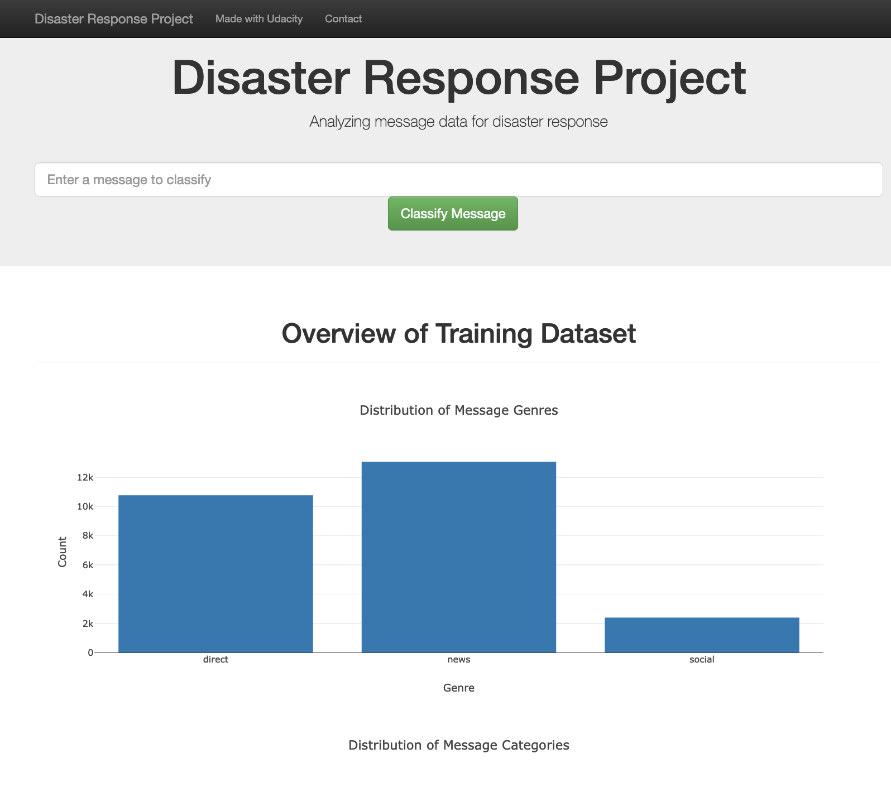
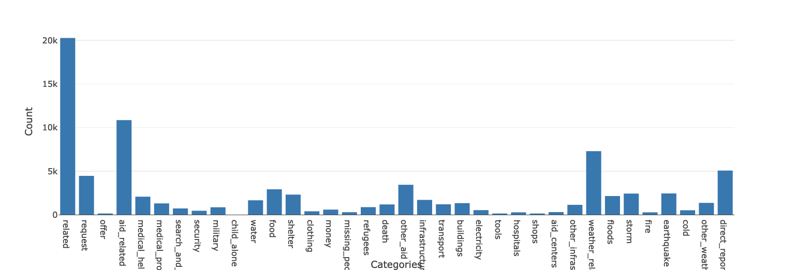
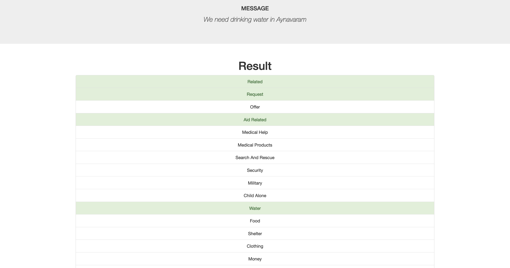

# Disaster Response Pipeline Project

###  Motivation:

The project aims to categorize the messages received during disasters and classify into different categories.

Data consists of real-word messages as raw texts sent during disasters. The data flows through an ETL pipeline that loads, cleans and dumps the data as a table in the given database. After the ETL pipeline, the data is trained using an ML pipeline. I chose Random Forest Classifier as my choice algorithm.

### File Structure:

	- app
	| - template
	| |- master.html  # main page of web app
	| |- go.html  # classification result page of web app
	|- run.py  # Python file that uses Flask to render results

	- data
	|- disaster_categories.csv  # data to process 
	|- disaster_messages.csv  # data to process
	|- process_data.py # file that does the ETL
	|- DisasterResponse.db   # database containing cleaned data

	- models
	|- train_classifier.py # file that contains the ML Pipeline
	|- classifier.pkl  # saved model 

	- README.md

### Instructions:
1. Run the following commands in the project's root directory to set up your database and model.

    - To run ETL pipeline that cleans data and stores in database
        `python data/process_data.py data/disaster_messages.csv data/disaster_categories.csv data/DisasterResponse.db`
    - To run ML pipeline that trains classifier and saves
        `python models/train_classifier.py data/DisasterResponse.db models/classifier.pkl`

2. Run the following command in the app's directory to run your web app.
    `python run.py`

3. Go to http://0.0.0.0:3001/

### Data visualization 

The data visualization in the web app looks like the image below.

### Classifying the message

When a message is fed into the web app, it categorizes into different categories.

Example below- 
Message - "We need drinking water in Aynavaram"

